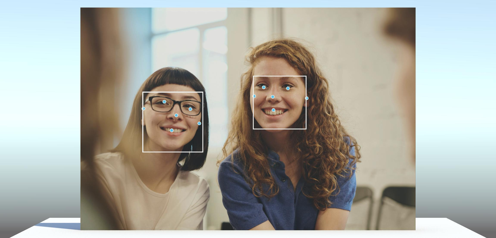

# BlazeFace in Inference Engine

BlazeFace is a fast, light-weight face detector from Google Research. A pretrained model is available as part of Google's [MediaPipe](https://ai.google.dev/edge/mediapipe/solutions/vision/face_detector) framework.



The BlazeFace model has been converted from TFLite to ONNX for use in Inference Engine using [tf2onnx](https://github.com/onnx/tensorflow-onnx) with the default export parameters.

## Functional API

The BlazeFace model takes a (1, 128, 128, 3) input image tensor and outputs a (1, 896, 16) boxes tensor and a (1, 896, 1) scores tensor.

Each of the 896 boxes consists of:
- [x position, y position, width, height] for the bounding box. The position is relative to the anchor position for the given index, these are precalculated and loaded from a csv file.
- [x position, y position] for each of 6 facial keypoints relative to the anchor position.

We adapt the model using the Inference Engine functional API to apply non maximum suppression to filter the boxes with the highest scores that don't overlap with each other.
```
var xCenter = rawBoxes[0, .., 0] + anchors[.., 0] * inputSize;
var yCenter = rawBoxes[0, .., 1] + anchors[.., 1] * inputSize;

var widthHalf = 0.5f * rawBoxes[0, .., 2];
var heightHalf = 0.5f * rawBoxes[0, .., 3];

var nmsBoxes = Functional.Stack(new[]
{
    yCenter - heightHalf,
    xCenter - widthHalf,
    yCenter + heightHalf,
    xCenter + widthHalf
}, 1);

var nmsScores = Functional.Squeeze(ScoreFiltering(rawScores, 100f));
var selectedIndices = Functional.NMS(nmsBoxes, nmsScores, iouThreshold, scoreThreshold); // (N);

var selectedBoxes = Functional.IndexSelect(rawBoxes, 1, selectedIndices).Unsqueeze(0); // (1, N, 16)
var selectedScores = Functional.IndexSelect(rawScores, 1, selectedIndices).Unsqueeze(0); // (1, N, 1)
```

## Model inference

We use the dimensions of the texture to set up an affine transformation matrix to go from the 128x128 tensor coordinates to the image coordinates. We then fill the input tensor using a compute shader with this affine transformation, points outside the image will correspond to zeros in the input tensor. 
```
var size = Mathf.Max(texture.width, texture.height);

// The affine transformation matrix to go from tensor coordinates to image coordinates
var scale = size / (float)detectorInputSize;
var M = BlazeUtils.mul(BlazeUtils.TranslationMatrix(0.5f * (new Vector2(texture.width, texture.height) + new Vector2(-size, size))), BlazeUtils.ScaleMatrix(new Vector2(scale, -scale)));
BlazeUtils.SampleImageAffine(texture, m_DetectorInput, M);

m_FaceDetectorWorker.Schedule(m_DetectorInput);
```

Execution is scheduled using an [Awaitable](https://docs.unity3d.com/6000.0/Documentation/ScriptReference/Awaitable.html) and the output tensors are downloaded and awaited. This frees up the main thread while the GPU computation and download takes place.
```
var outputIndicesAwaitable = (m_FaceDetectorWorker.PeekOutput(0) as Tensor<int>).ReadbackAndCloneAsync();
var outputScoresAwaitable = (m_FaceDetectorWorker.PeekOutput(1) as Tensor<float>).ReadbackAndCloneAsync();
var outputBoxesAwaitable = (m_FaceDetectorWorker.PeekOutput(2) as Tensor<float>).ReadbackAndCloneAsync();

using var outputIndices = await outputIndicesAwaitable;
using var outputScores = await outputScoresAwaitable;
using var outputBoxes = await outputBoxesAwaitable;
```
The output tensors are now on the CPU and can be read. We use the values from the output tensors together with the affine transformation matrix to set the transforms on the bounding boxes and keypoints for visualization.

In this demo we visualize the four faces with the highest scores that pass the score threshold.

## Notes
This model has been trained primarily for short-range faces in images taken using the front-facing smartphone camera, results may be poor for longer-range images of faces.

The non max suppression operator requires a blocking GPU readback, this prevents this demo from running on the WebGPU backend in Unity 6 and Inference Engine 2.2.