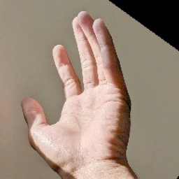
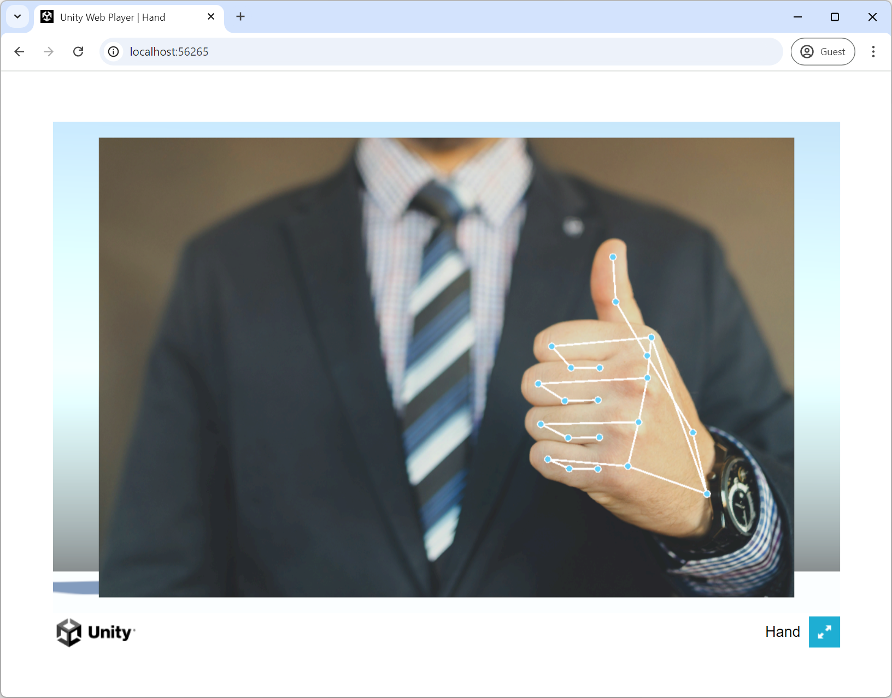

# BlazeHand in Sentis

BlazeHand is a fast, light-weight hand detector from Google Research. Pretrained models are available as part of Google's [MediaPipe](https://ai.google.dev/edge/mediapipe/solutions/vision/hand_landmarker) framework.


The BlazeHand models have been converted from TFLite to ONNX for use in Sentis using [tf2onnx](https://github.com/onnx/tensorflow-onnx) with the default export parameters.

## Functional API

The BlazeHand detector model takes a (1, 192, 192, 3) input image tensor and outputs a (1, 2016, 18) boxes tensor and a (1, 2016, 1) scores tensor.

Each of the 2016 boxes consists of:
- [x position, y position, width, height] for the palm bounding box. The position is relative to the anchor position for the given index, these are precalculated and loaded from a csv file.
- [x position, y position] for each of 7 palm keypoints relative to the anchor position.

We adapt the model using the Sentis functional API to apply arg max to filter the box with the highest score.
```
var detectionScores = ScoreFiltering(rawScores, 100f); // (1, 2254, 1)
var bestScoreIndex = Functional.ArgMax(rawScores, 1).Squeeze();

var selectedBoxes = Functional.IndexSelect(rawBoxes, 1, bestScoreIndex).Unsqueeze(0); // (1, 1, 16)
var selectedScores = Functional.IndexSelect(detectionScores, 1, bestScoreIndex).Unsqueeze(0); // (1, 1, 1)
```

The BlazeHand landmarker model takes a (1, 224, 224, 3) input image tensor cropped to the detected hand and outputs a (1, 63) tensor consisting of the x, y, and z coordinates for each of 21 hand keypoints. We use this model without adaptation.

## Model inference

We use the dimensions of the texture to set up an affine transformation matrix to go from the 192x192 tensor coordinates to the image coordinates. We then fill the input tensor using a compute shader with this affine transformation, points outside the image will correspond to zeros in the input tensor.
```
var size = Mathf.Max(texture.width, texture.height);

// The affine transformation matrix to go from tensor coordinates to image coordinates
var scale = size / (float)detectorInputSize;
var M = BlazeUtils.mul(BlazeUtils.TranslationMatrix(0.5f * (new Vector2(texture.width, texture.height) + new Vector2(-size, size))), BlazeUtils.ScaleMatrix(new Vector2(scale, -scale)));
BlazeUtils.SampleImageAffine(texture, m_DetectorInput, M);

m_HandDetectorWorker.Schedule(m_DetectorInput);
```

Execution is scheduled using an [Awaitable](https://docs.unity3d.com/6000.0/Documentation/ScriptReference/Awaitable.html) and the output tensors are downloaded and awaited. This frees up the main thread while the GPU computation and download takes place.
```
var outputIdxAwaitable = (m_HandDetectorWorker.PeekOutput(0) as Tensor<int>).ReadbackAndCloneAsync();
var outputScoreAwaitable = (m_HandDetectorWorker.PeekOutput(1) as Tensor<float>).ReadbackAndCloneAsync();
var outputBoxAwaitable = (m_HandDetectorWorker.PeekOutput(2) as Tensor<float>).ReadbackAndCloneAsync();

using var outputIdx = await outputIdxAwaitable;
using var outputScore = await outputScoreAwaitable;
using var outputBox = await outputBoxAwaitable;
```
The output tensors of the detector model are now on the CPU and can be read. If the score passes our score threshold, we use the box position and keypoint positions to set up a second affine transformation. This is calculated so that the hand will be centred, rotated and scaled to fill the landmarker input tensor.


```
var boxCentre_TensorSpace = anchorPosition + new float2(outputBox[0, 0, 0], outputBox[0, 0, 1]);
var boxSize_TensorSpace = math.max(outputBox[0, 0, 2], outputBox[0, 0, 3]);

var kp0_TensorSpace = anchorPosition + new float2(outputBox[0, 0, 4 + 2 * 0 + 0], outputBox[0, 0, 4 + 2 * 0 + 1]);
var kp2_TensorSpace = anchorPosition + new float2(outputBox[0, 0, 4 + 2 * 2 + 0], outputBox[0, 0, 4 + 2 * 2 + 1]);
var delta_TensorSpace = kp2_TensorSpace - kp0_TensorSpace;
var up_TensorSpace = delta_TensorSpace / math.length(delta_TensorSpace);
var theta = math.atan2(delta_TensorSpace.y, delta_TensorSpace.x);
var rotation = 0.5f * Mathf.PI - theta;
boxCentre_TensorSpace += 0.5f * boxSize_TensorSpace * up_TensorSpace;
boxSize_TensorSpace *= 2.6f;

var origin2 = new float2(0.5f * landmarkerInputSize, 0.5f * landmarkerInputSize);
var scale2 = boxSize_TensorSpace / landmarkerInputSize;
var M2 = BlazeUtils.mul(M, BlazeUtils.mul(BlazeUtils.mul(BlazeUtils.mul(BlazeUtils.TranslationMatrix(boxCentre_TensorSpace), BlazeUtils.ScaleMatrix(new float2(scale2, -scale2))), BlazeUtils.RotationMatrix(rotation)), BlazeUtils.TranslationMatrix(-origin2)));
BlazeUtils.SampleImageAffine(texture, m_LandmarkerInput, M2);

m_HandLandmarkerWorker.Schedule(m_LandmarkerInput);
```
The output tensor of the landmarker model is asynchronously downloaded and once the values are on the CPU we use them together with the affine transformation matrix to set the transforms on the keypoints for visualization.

## WebGPU
Unity 6 supports access to the WebGPU backend in early access. Sentis has full support for running models on the web using the WebGPU backend. Discover how to gain early access and test WebGPU in our [graphics forum](https://discussions.unity.com/t/early-access-to-the-new-webgpu-backend-in-unity-2023-3/933493).

