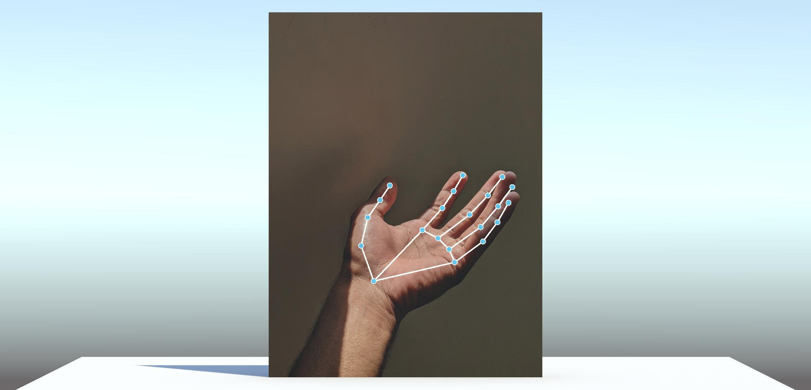

# Blaze detection models in Inference Engine

The blaze family of models are light-weight models for real-time detection from Google Research. Here we demonstrate using these pretrained models in Unity using Inference Engine.

We use the Inference Engine API to augment the models, run asynchronous inference on the GPU on all Unity backends.

These demos use images for detection, but can be easily adapted for videos or webcams.

## Face detection

We use the BlazeFace detector model with the Inference Engine non max suppression operator to recognise multiple faces in an image. Each face has a score, bounding box and 6 keypoints.

[Read more](./Face/README.md)

## Hand recognition

We use a two-step approach with the BlazeHand detector and BlazeHand landmarker models to recognise a hand in an image with 33 keypoints.

[Read more](./Hand/README.md)

## Pose recognition

We use a two-step approach with the BlazePose detector and BlazePose landmarker models to recognise a pose in an image with 21 keypoints.

[Read more](./Pose/README.md)