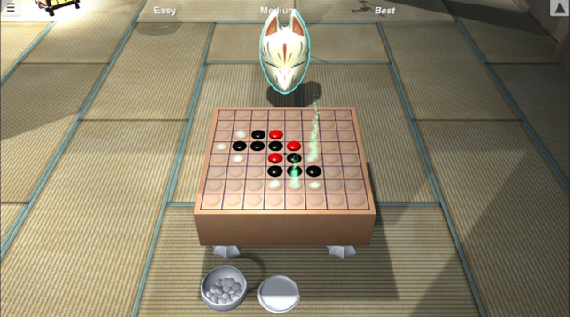
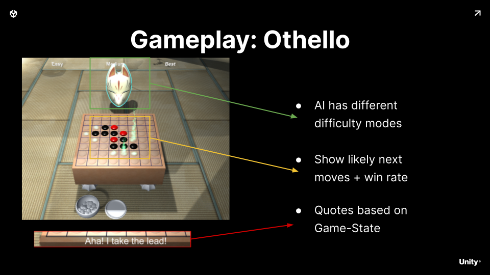
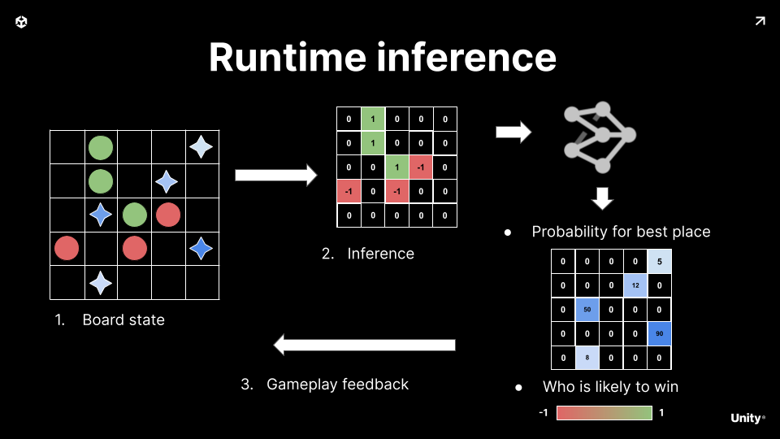

# Boardgame AI Sample
 
Othello mini-game showing how to integrate a neural network into the gameplay loop to drive a boardgame opponent.

## Gameplay Idea

We want to code an opponent that can play our boardgame.

Our boardgame can be somewhat complex with specific rules and opponent interactions and difficulty curves.

## Runtime Inference

To solve this problem we leverage a small Neural Network.

It takes as input the board state.

After running inference we get for every position on the board a possible move with its corresponding probability to win as well as who is currently winning.

We use this to feedback into the gameplay loop

## Video Tutorial

