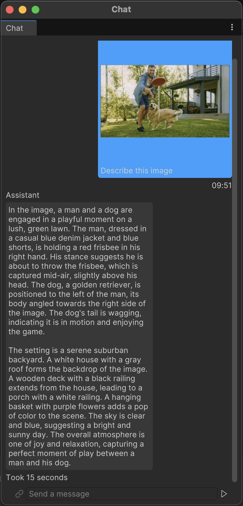

# Chat LLM Sample

Interactive chat interface powered by the LLaVA OneVision multimodal model running locally in Unity using Inference Engine.

## Gameplay Idea

We want to create an interactive chat experience where users can have conversations with a vision-language model that can understand both text and images.

The chat interface allows users to:
- Send text messages to the AI assistant
- Upload and share images for the model to analyze
- Receive intelligent responses that understand visual content
- Maintain conversation history for context

## Runtime Inference

To power this experience we leverage the LLaVA OneVision model, a multimodal large language model.

The system processes both text and image inputs:
- Text is tokenized and embedded using the model's text encoder
- Images are processed through a vision encoder to extract visual features
- The decoder generates contextual responses based on both modalities

We use this to create a seamless conversational AI experience.

## Features

- **Multimodal Understanding**: Processes both text and images in conversation
- **Real-time Inference**: Fast GPU-accelerated inference using Unity's Inference Engine
- **Editor Integration**: Available as an Editor window for development and testing
- **Streaming Responses**: Token-by-token response generation for responsive interaction
- **Model Management**: Automatic model downloading and validation

## Getting Started

1. Open the Unity project
2. Navigate to **Inference Engine > Sample > Chat > Start Chat** in the menu
3. Wait for models to download if running for the first time
4. Start chatting with the AI assistant!

The chat interface supports:
- Text-only conversations
- Image uploads with questions about the visual content
- Conversation history and context retention

## Technical Implementation

The sample demonstrates:
- Integration of multimodal LLM models in Unity
- Asynchronous model inference and streaming
- UI Toolkit for modern editor interfaces
- State management using Redux patterns
- Model scheduling and resource management