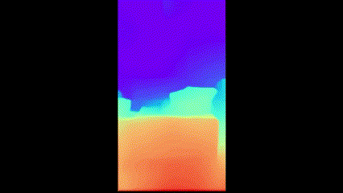
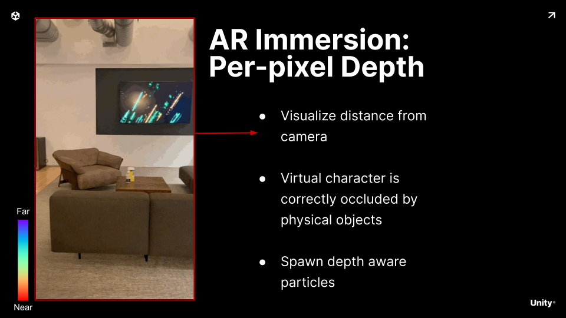
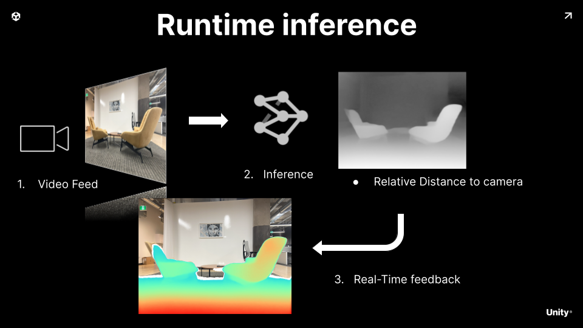
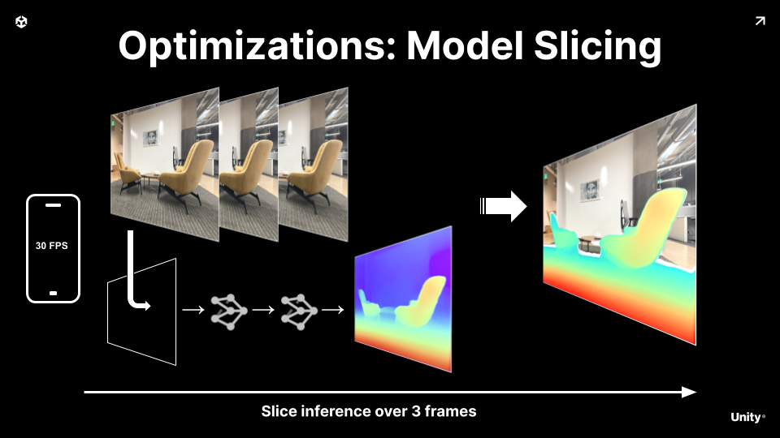

# Depth Estimation Sample
 
Realtime per pixel image to depth estimation.

## Gameplay Idea

We want an AR experience where physical objects in the scene occlude our virtual scene.

In order to do that we need accurate per pixel depth information of the real objects.

## Runtime Inference

To solve this problem we leverage a small Neural Network.

It takes as input the camera stream.

After running inference we get for every pixel of the input image a depth value.

We use this to feedback into the gameplay loop

## Optimization

To keep this within budget we split the model inference over 2 frame.

By running a lower frequency as the refresh rate, we avoid the phone to overheat

## Video Tutorial

