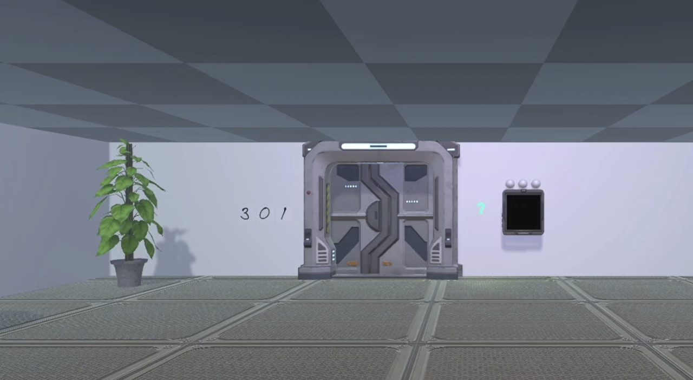
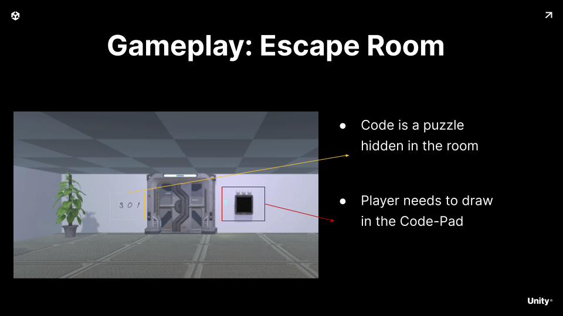
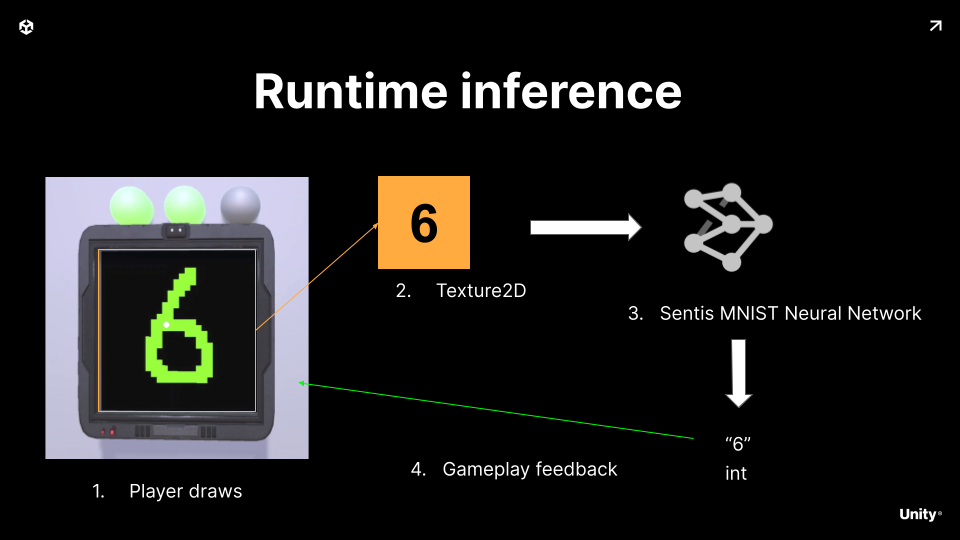

# Escape Room Sample
 
Escape room adventure showing how to integrate digit recognition into the gameplay loop.

## Gameplay Idea

We want a game where the player is stuck in a room and to escape they need to draw a code on a codepad.

## Runtime Inference

To solve this problem we leverage a small Neural Network.

It takes as input the code-pad texture.

After running inference we get the most likely digit.

We use this to feedback into the gameplay loop

##  Video Tutorial

