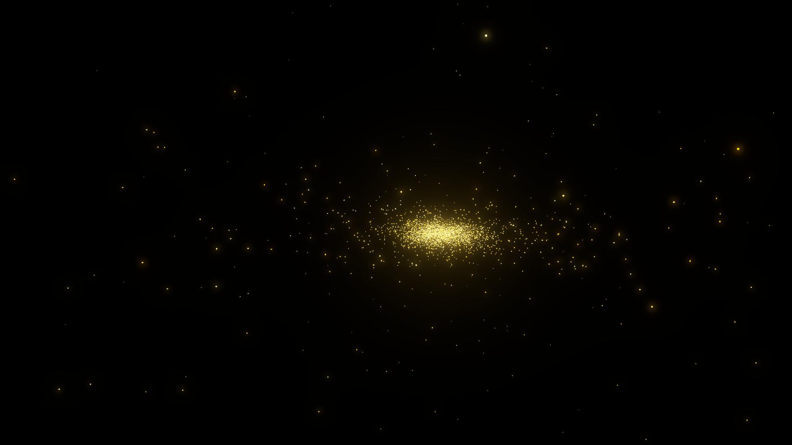

# Star Simulation Sample

Star simulation demo showing how to use Sentis as a linear algebra library, solving equations of motions, all on the GPU.



## Idea

Equations of motion can be written in matrix form (Hamiltonian mechanics https://en.wikipedia.org/wiki/Hamiltonian_mechanics).

Sentis is at its core a tensor-based linear algebra engine, so you can use this to simulate a physical system in real time.

The strength of this solution resides in the simplicity of writing out the system and efficient CPU/GPU code handling the intense computations while they remain on the GPU or Unity job system.

## Example

For this sample we start simple and tackle the N-body problem. A fairly trivial example, but still showing the strength of this method.

https://en.wikipedia.org/wiki/N-body_problem

## Solution

We want to simulate the equation of motions of N stars.

Each star will be represented by an emissive sphere.

Our physical system consists in 3 sets of tensors.

* Position : (N, 3) elements, x,y,z position per particle
* Mass : (M) elements, m scalar per particle
* Momentum : (M, 3) elements, px, py, pz momentum (mass * velocity) vector per particle

Each star corresponds to one element in those tensors.

Running the system results on using the previous frame tensors to compute the next frame's value given the equations of motions.

We will use the current values to update the position and brightness of each star

## Functional API

We won't get into the specifics of the equations of motion here.

But we write them out as matrix form (2D-tensor), using sentis [functional api](https://docs.unity3d.com/Packages/com.unity.sentis@2.1/manual/create-a-new-model.html).

This allows us to define sucessive tensor operations in a few lines of code, defining the system of equations to compute every frame.
We compile this set of operations to a `Model` which then can be used as usual.

## Accessing result on the GPU

We will dispatch the work on the GPU by creating a [Compute Worker](https://docs.unity3d.com/Packages/com.unity.sentis@2.1/manual/create-an-engine.html).
```
worker.SetInput("input_0", x);
worker.SetInput("input_1", m);
worker.SetInput("input_2", p);
worker.Execute();

var p_n = worker.PeekOutput("output_0") as TensorFloat;
var x_n = worker.PeekOutput("output_1") as TensorFloat;
```

The result will be the position and momentum tensors. Those tensors reside on the GPU and we can pin them directly to a vertex shader to update the particles positions.

```
Renderer renderer = planets[i].GetComponent<Renderer>();
renderer.material.SetBuffer("Positions", ComputeTensorData.Pin(x_n, clearOnInit: false).buffer);
renderer.material.SetInt("Index", i);
```
