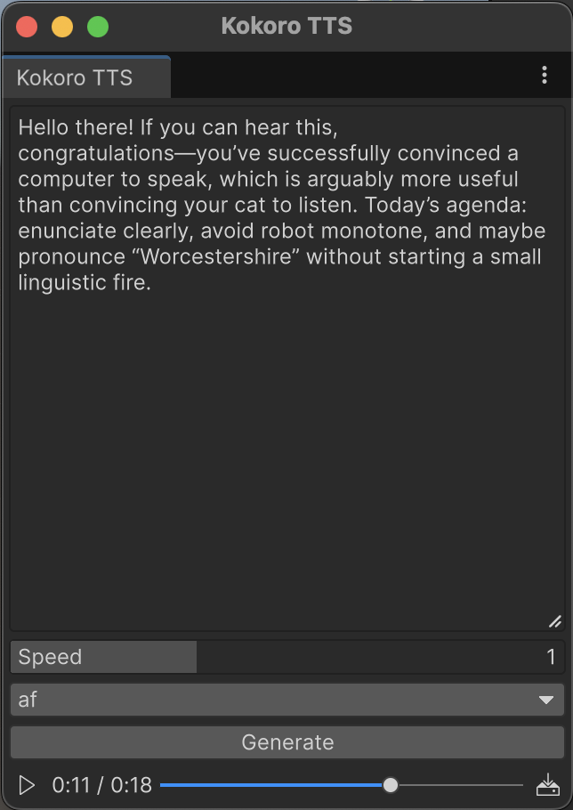

# Text-to-Speech Sample

Interactive text-to-speech interface powered by the Kokoro TTS model running locally in Unity using Inference Engine.

## Runtime Inference

To power this experience we leverage the [Kokoro-82M-v1.0-ONNX](https://huggingface.co/onnx-community/Kokoro-82M-v1.0-ONNX) model, a high-quality neural text-to-speech model.

The system processes text inputs through:
- Text tokenization and grapheme-to-phoneme conversion using our C# implementation of Misaki for English
- Neural voice synthesis using the Kokoro ONNX model
- Real-time audio generation with multiple voice options
- Configurable speech speed and voice selection

We use this to create a seamless text-to-speech experience with natural-sounding voices.

## Features

- **Multiple Voices**: Choose from various pre-trained voice styles
- **Speed Control**: Adjustable speech rate for different use cases
- **Real-time Generation**: Fast GPU-accelerated inference using Unity's Inference Engine
- **Editor Integration**: Available as an Editor window for development and testing
- **Cross-Platform**: Support for macOS, Windows, Linux, and Android
- **Model Management**: Automated model downloading and setup
- **Phoneme Processing**: Automatic grapheme-to-phoneme conversion using dictionary-based lookup with comprehensive English lexicon

## Getting Started

1. Open the Unity project
2. Download models by navigating to **Inference Engine > Sample > TTS > Download Models** in the menu
3. Navigate to **Inference Engine > Sample > TTS > Start TTS** in the menu
4. Enter text and generate speech with your chosen voice!

Alternatively, you can use the runtime scene at `TextToSpeechSample/Assets/Scenes/App.unity`, but make sure to download the models beforehand using the editor menu.

The TTS interface supports:
- Multi-line text input
- Voice selection from available models
- Real-time speech generation
- Audio playback controls

## Grapheme-to-Phoneme Conversion

This sample features a complete C# implementation of dictionary-based grapheme-to-phoneme conversion, inspired by the Misaki project. The system includes:

- **Comprehensive English Lexicon**: Uses gold and silver pronunciation dictionaries with over 130,000 word entries
- **Intelligent Text Processing**: Handles contractions, possessives, punctuation, and Unicode characters
- **Morphological Analysis**: Automatic handling of word variants with suffixes (-s, -ed, -ing)
- **Context-Aware Pronunciation**: Adjusts pronunciation based on surrounding context (e.g., "the" before vowels vs consonants)
- **No External Dependencies**: Self-contained implementation requiring no external tools or processes

The phoneme conversion system processes text through sophisticated tokenization, dictionary lookup, and fallback mechanisms to ensure accurate pronunciation for the Kokoro TTS model.

## Technical Implementation

The sample demonstrates:
- Integration of neural TTS models in Unity
- Asynchronous model inference with Kokoro
- AppUI for modern editor interfaces
- State management using Redux patterns
- Model scheduling and resource management
- Cross-platform audio generation
- Advanced text-to-phoneme processing with comprehensive English language support